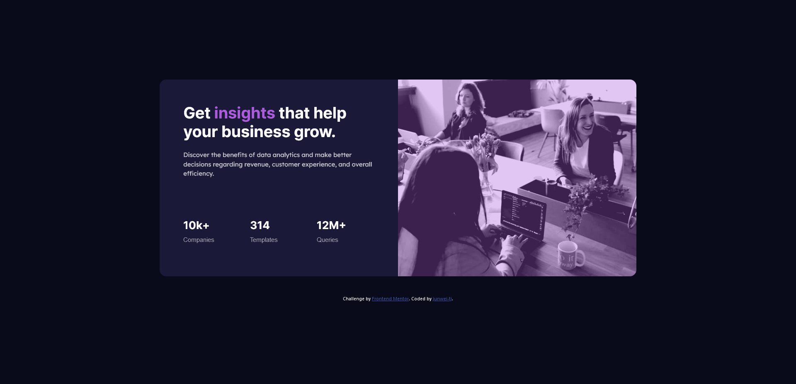

# Frontend Mentor - Stats preview card component solution

This is a solution to the [Stats preview card component challenge on Frontend Mentor](https://www.frontendmentor.io/challenges/stats-preview-card-component-8JqbgoU62). Frontend Mentor challenges help you improve your coding skills by building realistic projects. 

## Table of contents

- [Overview](#overview)
  - [The challenge](#the-challenge)
  - [Screenshot](#screenshot)
  - [Links](#links)
- [My process](#my-process)
  - [Built with](#built-with)
  - [What I learned](#what-i-learned)
  - [Continued development](#continued-development)
  - [Useful resources](#useful-resources)
- [Author](#author)
- [Acknowledgments](#acknowledgments)

## Overview

### The challenge

Users should be able to:

- View the optimal layout depending on their device's screen size

### Screenshot

### Links

- Solution URL: [GitHub](https://github.com/junwei-tj/stats-preview-card-component-frontend-mentor)
- Live Site URL: [GitHub Pages](https://junwei-tj.github.io/stats-preview-card-component-frontend-mentor/)

## My process

### Built with

- HTML
- CSS
- Bootstrap 5
- Semantic HTML5 markup

**Note: These are just examples. Delete this note and replace the list above with your own choices**

### What I learned
The main learning points for me was the use of CSS and Bootstrap, and mobile-responsiveness development. 

As someone who finds flexbox more intuitive, trying to learn the grid system as a "hacky" way of creating a mobile-friendly page was a challenge. Not to mention the fact that I am still relatively new to Bootstrap, I found myself frustrated at times over seemingly easy tasks.

A major learning point for me was the use of padding. Rather than relying on setting `height: 100%`, I realized the use of padding allows me to centralize elements equally well. In fact, when I used the attribute `height`, I encountered many problems getting my elements' height to stay consistent across multiple viewport widths. Specifically, I had issues sitting the image nicely in the card. These issues were ultimately solved with the use of padding and removing `height` attributes.

### Continued development

As this project is of newbie difficulty, and I struggled even with simple centering and managing Bootstrap grid system, I definitely have a long way to go with becoming more proficient with making **mobile-friendly websites** and using **Bootstrap** effectively. Thus, these are the 2 areas I will continue to focus on.

## Author

- Frontend Mentor - [@junwei-tj](https://www.frontendmentor.io/profile/junwei-tj)